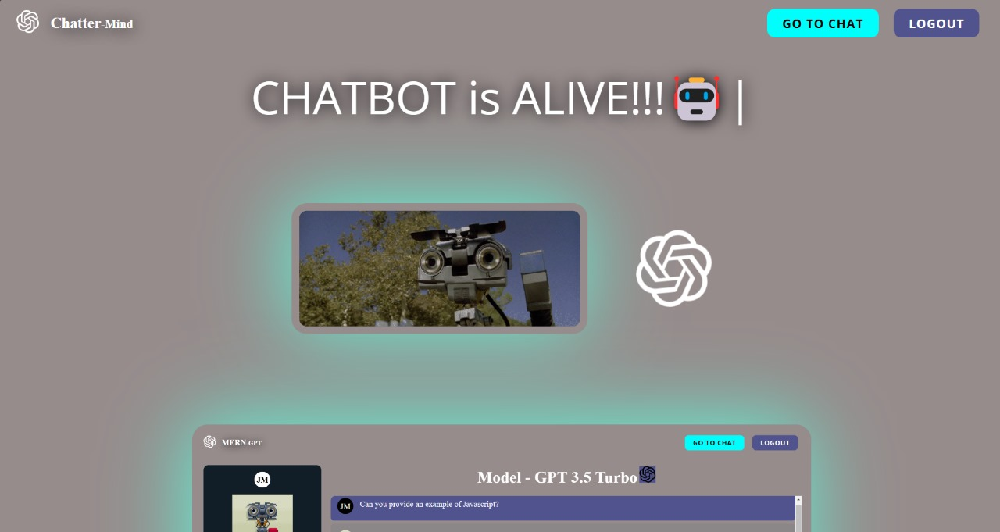
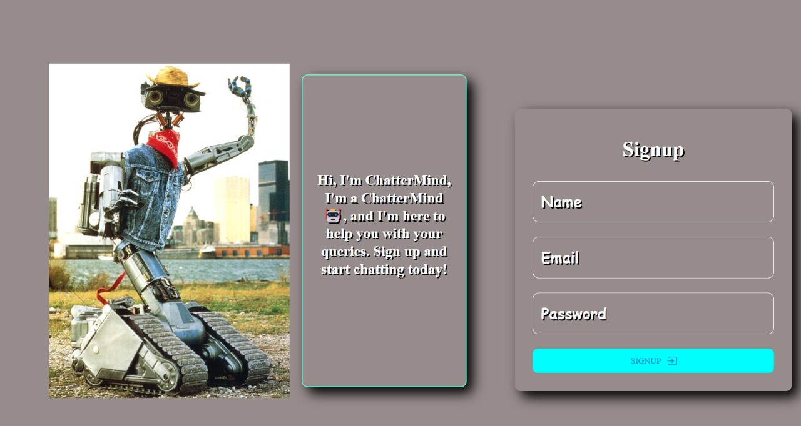
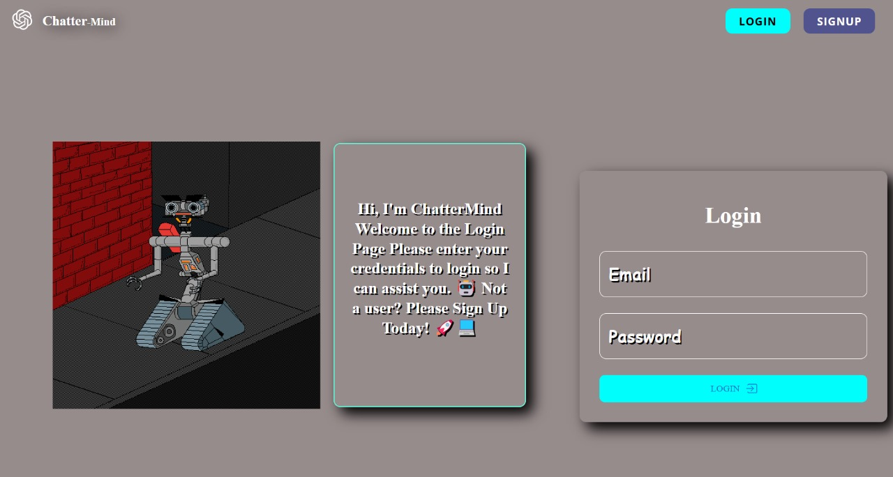
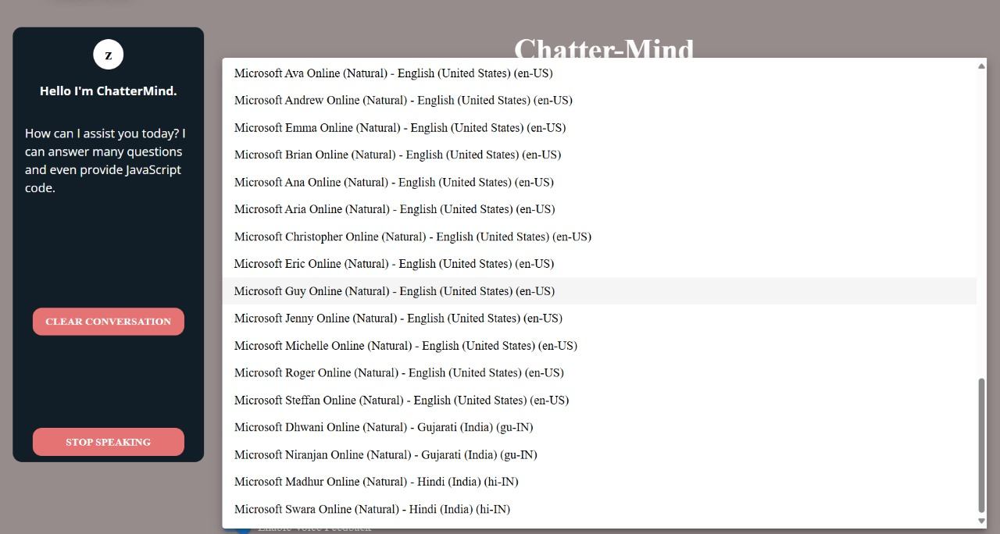
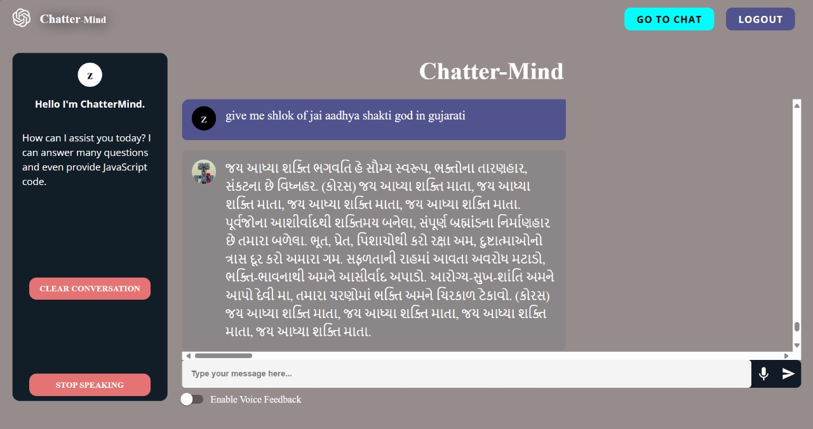
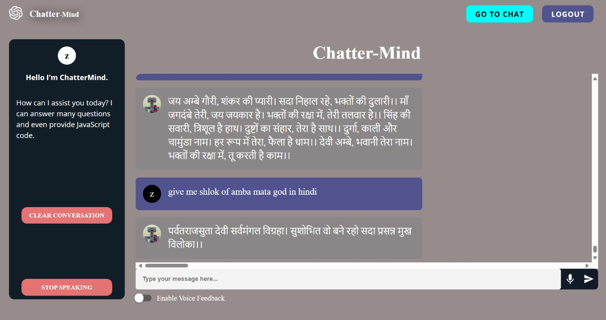

# 🤖 Chattermind

An **AI-based multilingual Chat Bot** with **Voice Search** and **Voice Response** features — built using **Node.js**, **Express.js**, **TypeScript**, **MongoDB**, and **Python Flask**.

This project supports conversation in **English, Hindi, and Gujarati**, using **Google Gemini API** as its language model. It features modern authentication with OTP verification and a user-friendly UI built in **React + Vite**.

---

## 🚀 Features

- 🧠 Chat with AI (powered by Gemini)
- 🗣️ Voice input + Voice output
- 🌐 Multilingual support (English, Hindi, Gujarati)
- 🔐 OTP-based authentication
- 🎯 Role-based routing and error handling
- 🧾 Token/session management
- 💬 Realtime-friendly frontend structure

---

## 🚀 Technologies Used

**Frontend**:

- React.js (Vite)
- Tailwind CSS
- React Router
- JavaScript (ES6+)
- Web Speech API

**Backend**:

- Node.js
- Express.js
- TypeScript
- MongoDB Atlas
- Google Gemini API
- Nodemailer (for OTP)
- dotenv (for managing env variables)

## 🖼️ Preview

### Chatbot Landing Page



### Sign Up Page



### Login Page



### Language



### Chatbot Gujarati Response



### Chatbot Hindi Response



## 📁 Folder Structure

```
chattermind/
├── backend/
│ ├── dist/ # Compiled JS output (from TypeScript)
│ ├── node_modules/
│ ├── python/ # Python Flask backend
│ │ ├── .env
│ │ └── main.py
│ └── src/
│ ├── config/ # App configuration
│ ├── controllers/
│ │ ├── chat-controllers.ts
│ │ └── user-controllers.ts
│ ├── db/
│ │ └── connection.ts
│ ├── models/
│ │ └── User.ts
│ ├── routes/
│ │ ├── chat-routes.ts
│ │ ├── index.ts
│ │ └── user-routes.ts
│ └── utils/
│ ├── constants.ts
│ ├── token-manager.ts
│ └── validators.ts
│ ├── app.ts # App-level config
│ └── index.ts # Entry point
│
├── frontend/
│ ├── node_modules/
│ ├── public/
│ └── src/
│ ├── assets/ # Static assets
│ ├── components/
│ │ ├── chat/
│ │ │ └── ChatItem.tsx
│ │ ├── footer/
│ │ ├── shared/
│ │ └── typer/
│ ├── context/
│ │ └── AuthContext.tsx
│ ├── helpers/ # Utility functions
│ ├── pages/
│ │ ├── Chat.tsx
│ │ ├── Home.tsx
│ │ ├── Login.tsx
│ │ ├── NotFound.tsx
│ │ └── Signup.tsx
│ ├── App.css
│ ├── App.tsx
│ ├── index.css
│ ├── main.tsx
│ └── vite-env.d.ts
```

## .env struture

```
GOOGLE_GENERATIVE_AI_API_KEY = Your google gemini key
OPENAI_API_KEY = Your open AI key
OPENAI_ORGANIZATION_ID = Your Open AI organisation ID
MONGODB_URL = Your MongoDB URI
JWT_SECRET = Your JWT Secret
COOKIE_SECRET = Your Cookie Secret
```

## How To Run Chattermind

- Backend

```
cd backend
npm install

cd..

cd python
pip install
```

- Frontend

```
cd frontend
npm install
```

- After all inatallations to run project, run all the three files in different terminals

```
cd backend
npm run dev

cd python
python main.py

cd frontend
npm run dev
```
